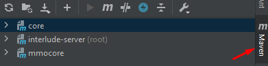
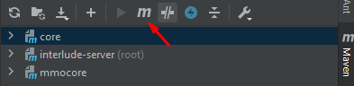
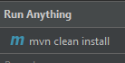
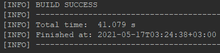

# Requirements and installation
###### Necessary
- [x] [Java 11 SDK](https://www.oracle.com/ru/java/technologies/javase-jdk11-downloads.html)
- [x] [MySQL 5.7](https://dev.mysql.com/downloads/mysql/5.7.html)
- [x] [Fin-ex Interlude Sources](https://github.com/finfan222/finex-interlude)

###### Unnecessary
- [x] [IntelliJ IDEA v2020.2.4](https://www.jetbrains.com/idea/) - for working on at source code
- [x] [Navicat Premium for MySQL](https://www.navicat.com/en) - for control database
- [x] [Notepad++](https://notepad-plus-plus.org/downloads/) - for fast editing of .xml, .json or other txt files in datapack (or use sublime text editor)
- [x] [Sublime Text Editor](https://www.sublimetext.com) - for fast editing of .xml, .json or other txt files in datapack (or use notepad++)

# Installing Necessary
###### Java JDK 11
[Full Installation Manual](https://docs.oracle.com/cd/E39271_01/studio.300/studio_install/src/tidi_studio_weblogic_install_jdk.html)

###### MySQL 5.7
[Full Installation Manual](https://software.grok.lsu.edu/Article.aspx?articleid=18737)

###### Fin-ex Interlude Sources
[Full Clone Manual On Desktop](https://docs.github.com/en/github/creating-cloning-and-archiving-repositories/cloning-a-repository#cloning-a-repository-to-github-desktop)

# Installing Unnecessary
###### IntelliJ IDEA
[Full Installation Manual](https://treehouse.github.io/installation-guides/windows/intellij-idea-win.html)

###### Navicat Premium
[Full Installation Manual](https://www.navicat.com/manual/online_manual_new/en/navicat/win_manual/#/installation)

###### Notepad++
[Full Installation Manual](https://npp-user-manual.org/docs/getting-started/)

###### Sublime Text Editor
[Full Installation Manual](https://www.tutorialspoint.com/sublime_text/sublime_text_installation.htm)

# Folder description
When you will clone it or download or else, read next notice:
1. \_retail_game_* - specified folder for your game server with all needed data
2. \_retail_login_ - specified folder for your login server with all needed data
3. \_retail_sql_ - specified folder for your sql with all needed .sql files
4. core - folder with sources (need to be compiled by maven)
5. docs - folder with all readme.md files
6. libs - folder with all needed compiled libraries (.jar)
7. mmocore - folder with sources of mmo network

# Compile with maven: core/mmocore
If you dont have installed [IntelliJ IDEA v2020.2.4](https://www.jetbrains.com/idea/), you can skip this step, cause documentation about compile on these two IDE's
If you have installed on of them, so you need:
1. Open IDEA
2. File -> Open -> Downloaded Project, you will see something like that

- If you see it just like a folder (without black square mark), so you need create a project from it: File -> New -> Create from existing sources -> OK -> Import project from external model and set point on maven symbol 
3. Wait until indexation is ends
4. Click on Maven button on the right corner 

5. Click on 'M' symbol of maven

6. and write a goal: _mvn clean install_

7. Wait until the console not writes _BUILD SUCCESS_

8. Go to _core/target/_ and copy core-1.x.x.jar (instead of 'x' you will see the numbers)
9. Copy that .jar to a libs folder (if libs folder already has a .jar with old version - delete them)
10. Do same with mmocore (you can compile it and place to libs folder only once, in next compilations it's not needed)
11. Congratulations you already have installed a new core on your server
